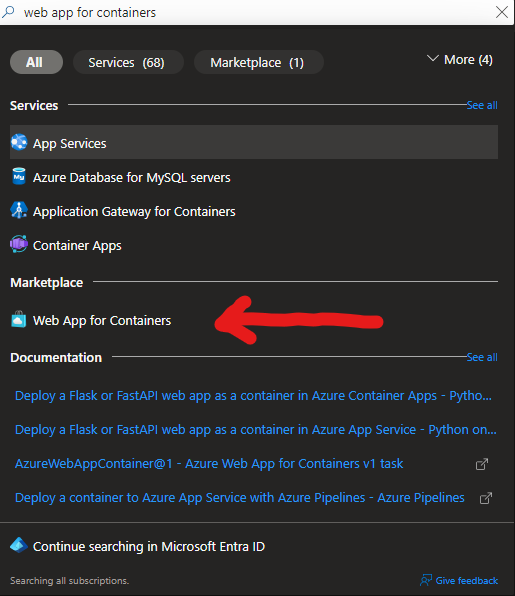
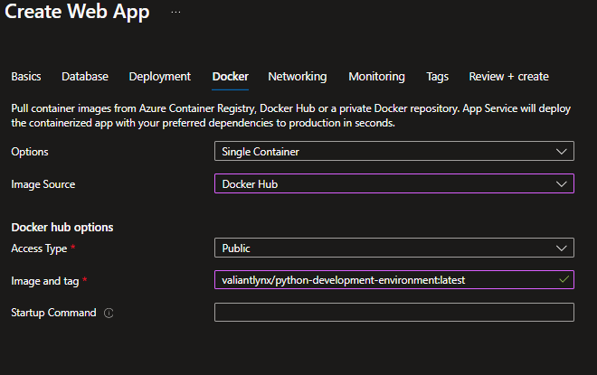
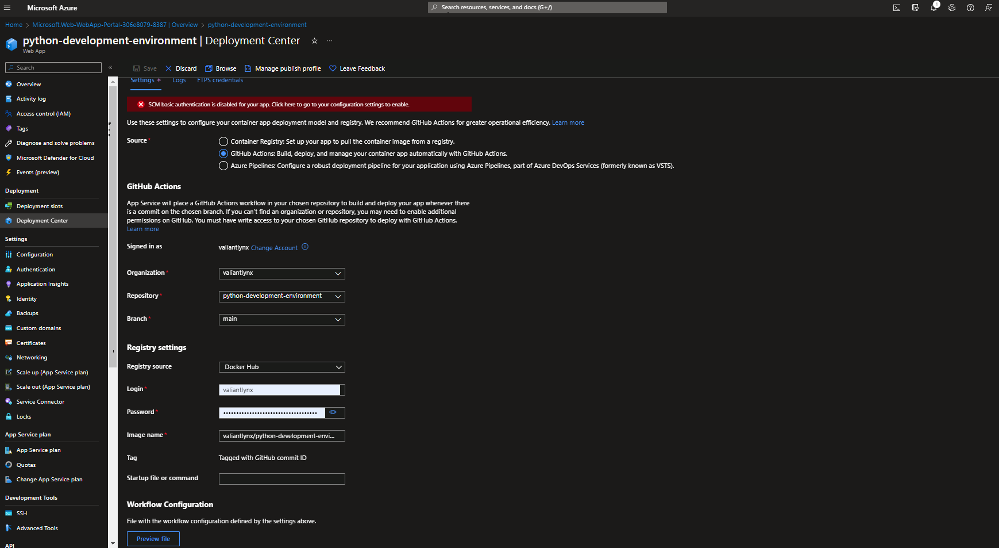
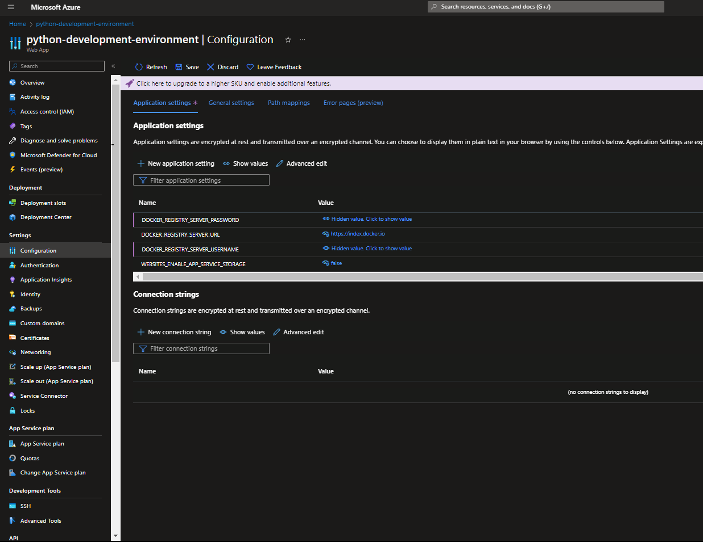
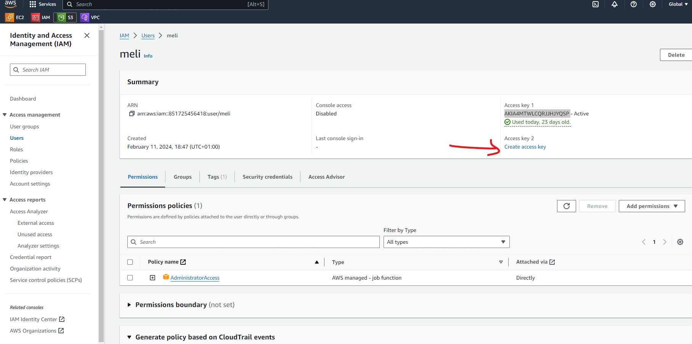

 ## Introduction 
 This GitHub project provides a comprehensive guide and a set of resources to create and manage infrastructure using Terraform and automate the deployment process using GitHub Actions. 
 
 Terraform is an open-source infrastructure as code (IaC) tool that allows you to define and provision infrastructure using a declarative configuration language. 
 
 Whereas GitHub Actions is a powerful automation and CI/CD platform provided by GitHub.

 
By combining Terraform and GitHub Actions, you can:

**Define Infrastructure as Code**: Define your infrastructure components, such as virtual machines, databases, and networks, in a Terraform configuration file.

**Automate Deployment**: Set up GitHub Actions workflows to automatically deploy your infrastructure whenever there are changes to your Terraform configuration.

**Version Control**: Keep your infrastructure code version-controlled and easily collaborate with your team.

**Infrastructure as Code Best Practices**: Follow best practices for infrastructure as code, including versioning, code review, and documentation.

This project serves as a starting point for your infrastructure automation journey, providing a basic structure and guidelines to build upon.

## Prerequisites
Before you begin, ensure you have the following prerequisites:

* GitHub Account
* Terraform installed on your local machine.
* Access to a cloud provider account (e.g., AWS, Azure, Google Cloud) and necessary API credentials.

# devops Environment Setup Template

it has docker-compose for development and deploying. it also configured with .devcontainer så you can go into the container and work on it from there. another way is it has python environment using the commands in run.sh or run.bat.


# a dev environment for python

```bash
docker-compose up --build -d
docker-compose down
```

# (Optional) everything after this is optional
# deployment
there are two ways. one is simpler using azure container. it just deploys the app to your azure account.
the 2nd option is more heavy duty but comes with more. while the first is just a container. the second one is a full on server. the server is a free tier ec2(if you only have one server).
to choose, its the one in the workflows folder thats active. for azure have the deploy-azure.yml and vision-ai.yml in the folder and the other two in the extra_workflows folder.
for terraform have the deploy-terraform.yml, detroy.yml and vision-ai.yml in the workflow folder and deploy-azure.yml in the extra_workflows folder

for both you need docker hub account
# docker hub 
go to https://hub.docker.com/settings/security and create and copy the token. together with your username go to (your repository)https://github.com/valiantlynx/python-development-environment/settings/secrets/actions and make these repository secrets
- DOCKER_HUB_USERNAME = your username
- DOCKER_HUB_PASSWORD = your docker access token

# cloudflare
also i use cloudflare as my dns. this is cause they allow me to edit dns records dynamicly for free. so for that you would also need to add these two en variables. if you dont you can comment the relevant parts of the code:
- CLOUDFLARE_EMAIL = your cloudflare email
- CLOUDFLARE_API_TOKEN = your cloudflare api token

# azure
its just a github action that uses your dockerfile. 
got to [azure](https://portal.azure.com/#home) and search for `web app for containers`
choose this:

and then these details:


in the docker section choose what your docker details will be in docker hub. (username/container-name):


leave the rest as they are(yes even deployment can be done later) and review and create.
after the resource is built go to it then deployment center and choose this config(try to relly on azures auto fill to fill this form if possible):

to remove that error so we can save. we need to set the variables in azure
got to configurations and edit the two docker stuff that are empty:

go to general settings tab and turn on SCM basic auth.
save it and go back to deployment center. your might have to redo some of the former step. then save


we need some env variables for authentication in git hub action. go back to overview and on the top is the option Download publish profile. copy the whole file and lets go to github

first the login stuff. go to (your repository)https://github.com/valiantlynx/vision-ai/settings/secrets/actions and make these repository secrets(you might see two env variables azure made delete them)
if your planing to use azure
- AZUREAPPSERVICE_PUBLISHPROFILE = the thing you downloaded and copied

now the next time you commit to there is a succesfull pull or push to the main branch and the docker image is on docker hub then azure will redeploy

to see the app azure provides a free url something like https://vision-ai.azurewebsites.net/ go there and you might have to wait like 10 min the first time around. or make a commit to main again a couple times

# terrafrom
this does alot for and is simpler to set up. 
### what you get
simply put its IaC with terraform, config with ansible, monitoring with prometheus-grafana and service-check with uptime-kuma and container management with portainer.
it all automated as well
## setup
you need an aws account. in it make an s3 bucket called ´python-development-environment´ it can be anything it just has to match with the one in terraform/provider.tf aws. 
and lastly access keys, you can get thenm in IAM. just create access key cause we need both the key and the secret


the login stuff. go to (your repository)https://github.com/valiantlynx/python-development-environment/settings/secrets/actions and make these repository secrets
if your planing to use azure
- AWS_ACCESS_KEY = that you copied
- AWS_SECRET_ACCESS_KEY = the secret you copied

### this devops sets up everything even ssl. so edit the somain ports and images to your needs
all the files you need to edit are in andible/roles/docker_deploy/files unfortunately for this you need some knowledge(basic is enough) in docker, nginx and certbot. 
specifically, 
andible/roles/docker_deploy/files/docker/docker-compose.yml - for ports and which domain you want ssl for and containers. 
andible/roles/docker_deploy/files/docker/prometheus.yml - together with the one above for your monitoring needs
andible/roles/docker_deploy/files/nginx/http.conf - both this and below need to be edited on each edit. for http edits. and where the containers are accessed. reverse proxy
andible/roles/docker_deploy/files/nginx/https.conf - both this and above need to be edited on each edit. for https edits. and where the containers are accessed. reverse proxy

you can look at my git is some of my repos logs to get an idea of how i do or contact me for help.

now the next time you commit to there is a succesfull pull or push to the main branch and the docker image is on docker hub then terraform with deploy the infra and ansible will configure everything all the way to ssl.
this means the first time its building it might fail. that cause the domains that certbot is trying to get ssl for might not be pointing to the newly created ec2. you need to go to your dns and point it to the correct ip.


## some usefule commands
set the aws env variables
```bash
aws configure
```

```bash
terraform init
```

```bash
terraform validate
```

```bash
terraform plan
```

```bash
terraform apply --auto-approve
```	

```bash
terraform destroy --auto-approve
```	

```bash
ansible-playbook -i 13.60.38.190, -e "ansible_user=ubuntu ansible_ssh_private_key_file=modules/pk/terraform-key.pem" ../ansible/deploy-app.yml
ansible-playbook -i ../ansible/inventory/dynamic_inventory.ini ../ansible/deploy-app.yml
```
